# Udacity - Building a CI/CD Pipeline


# Project Plan

Trello Board - https://trello.com/b/xp0TWgAK/udacity-devops

Project Management Spreadsheet - https://docs.google.com/spreadsheets/d/1bqPJ-2aDkCJGl4yBkFtZAZzYJxTQQ9VXvcFPRmM7nu0/edit?usp=sharing

# Architecture

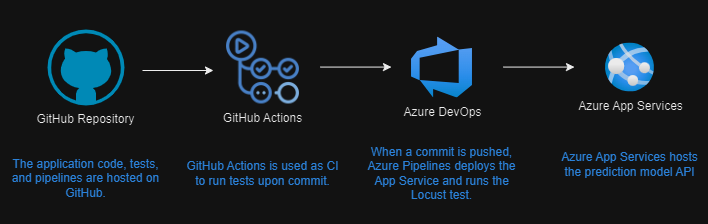

# Instructions

## Azure Cloud Shell / GitHub Actions

- Create a fork of this repository to be used for the rest of the instructions.
- Enable GitHub Actions for the forked repository.
  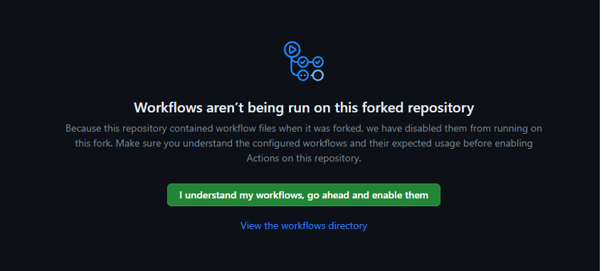
- Login to the Azure Portal and open an Azure Shell session.
- Generate an SSH key and add it to your GitHub account.

```
ssh-keygen
```

- Clone the Git repository.
  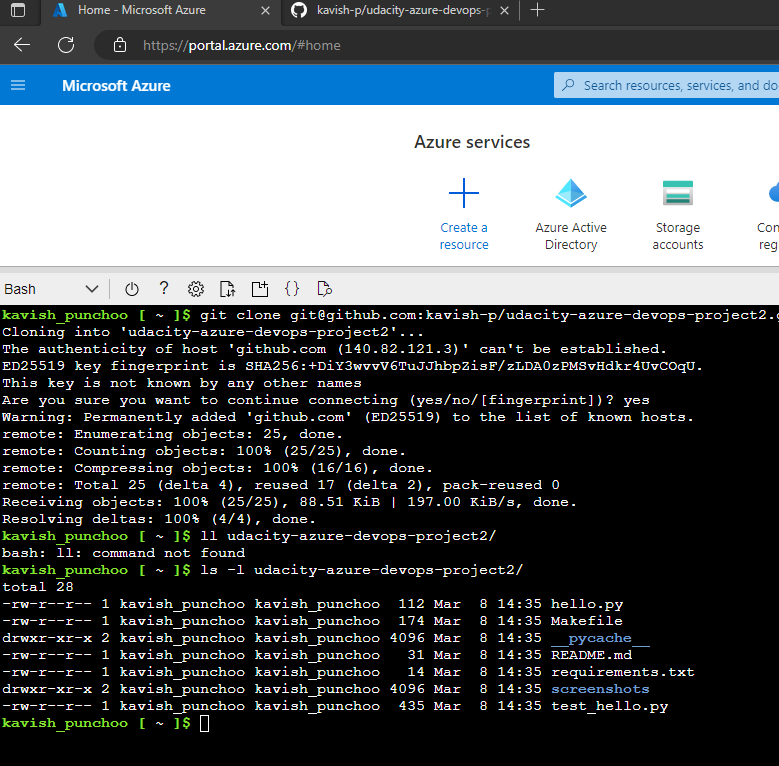
- `cd` into the cloned repository and run `make all`.
  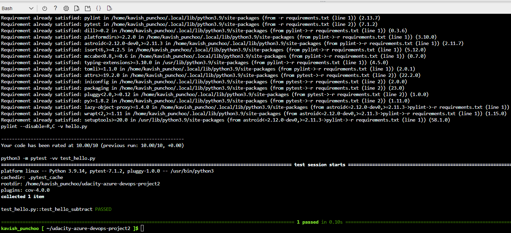
- After enable Github Actions, the workflow execution would be as shown here, similar to the Cloud Shell output.
  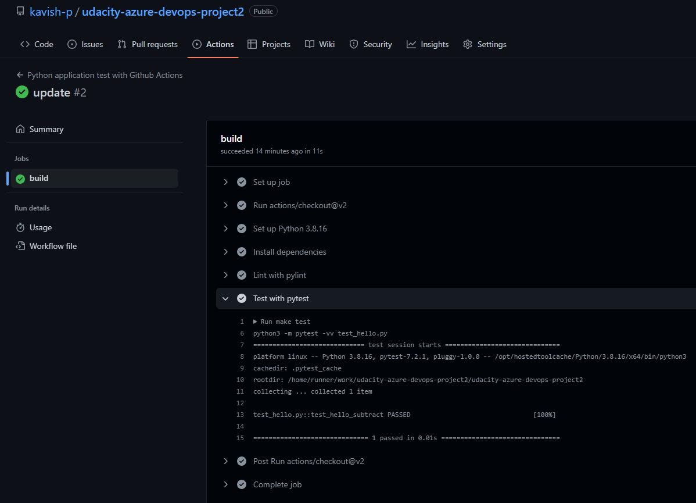
- Create the App Service by running the following command in Azure Cloud Shell. You may need to change some parameters such as name, resource group, or add parameters such as location (region), sku, and so on.

```
az webapp up --name k123webapp --resource-group hackaton --runtime "PYTHON:3.8"
```

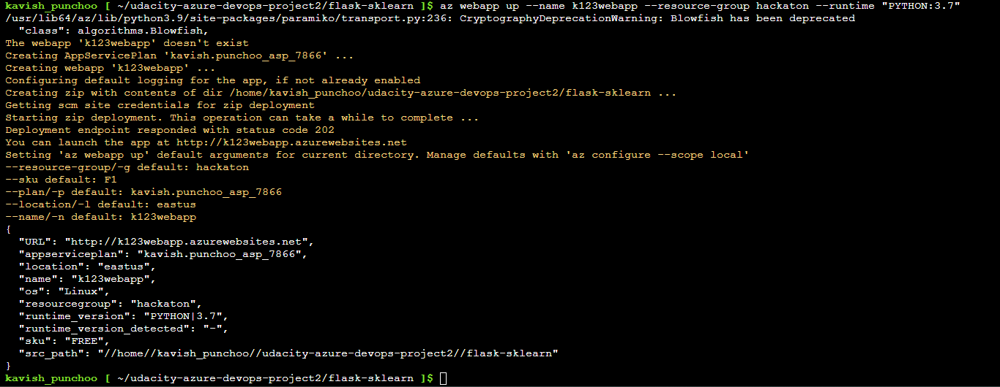

- Edit the endpoint in the `make_predict_azure_app.sh` script and run the script to test the deployed app.
  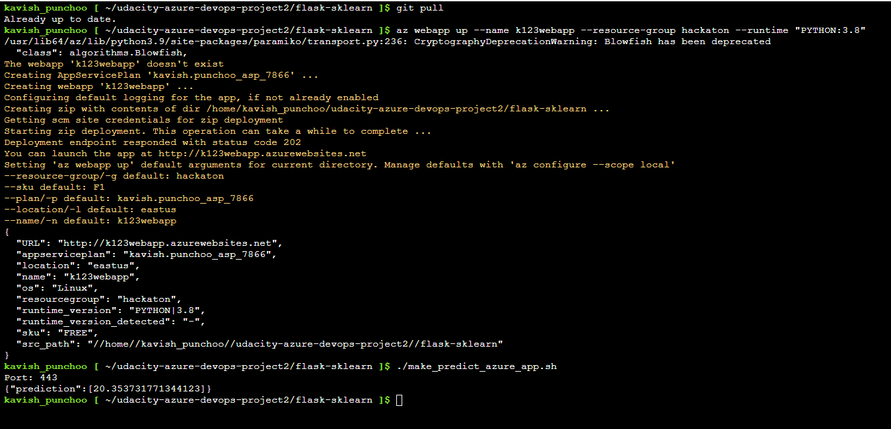
  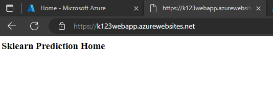

## Azure DevOps

- Login to Azure DevOps and create a project if none exist.
- Under project settings, create a new Azure Resource Manager service connection.
- Create a new pipeline and select GitHub as the source. After authenticating, select your repository and choose Existing YAML file.
  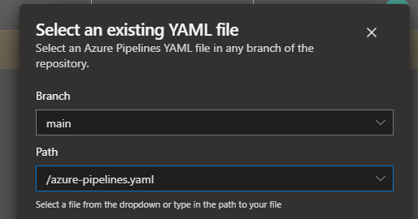
- You would need to make changes to the pipeline YAML file and set your App Service name and Azure Subscription.
- Upon execution, the pipeline will run the lint test and deploy the App Service.
- Make a change on the home page of the app. Edit `app.py`.

```
def home():
    html = "<h3>Sklearn Prediction Home - deployed from Azure Pipelines</h3>"
    return html.format(format)
```

- Rerun the pipeline.
  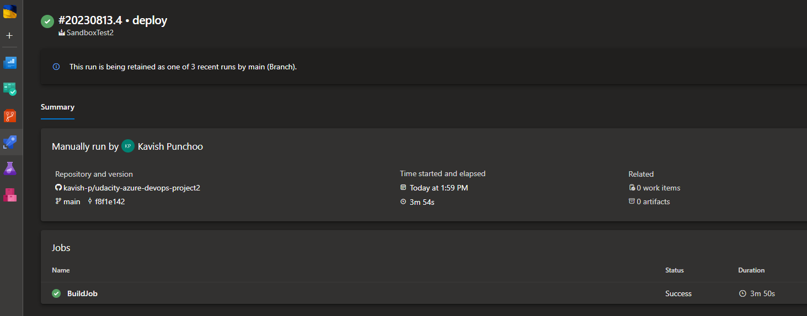
  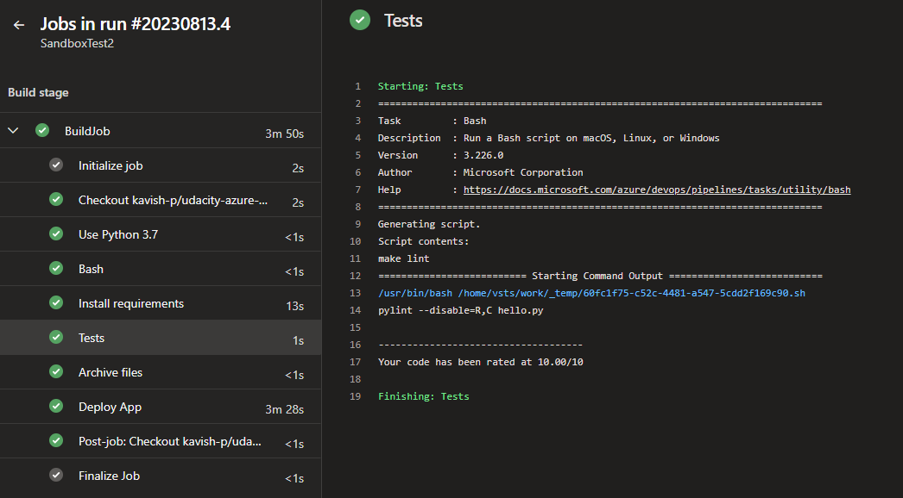
  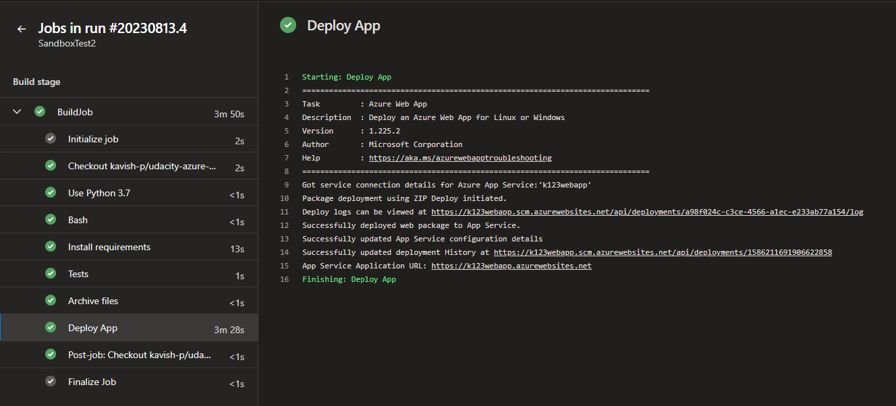
- The deployed app would have the change made.
  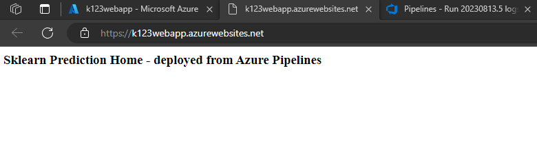
- Run the prediction script and check the logs on Azure Portal.
  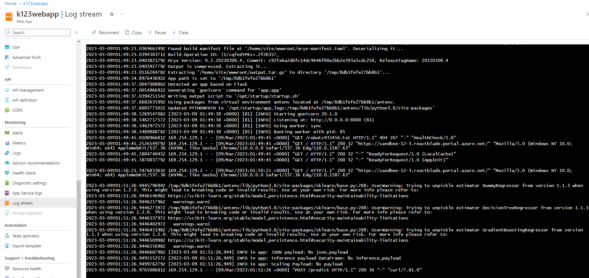

## Load Testing

- Install locust on Azure Cloud Shell or another shell environment.

```
pip install locust
```

- Run the test.

```
locust --headless --users 5 --run-time 5s -H https://k123webapp.azurewebsites.net/
```

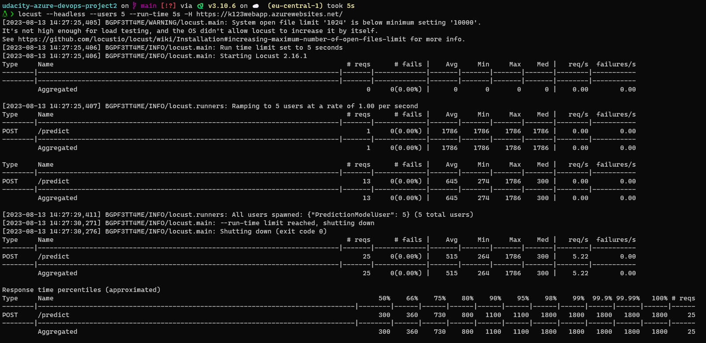

- Check the logs of the app service once again.
  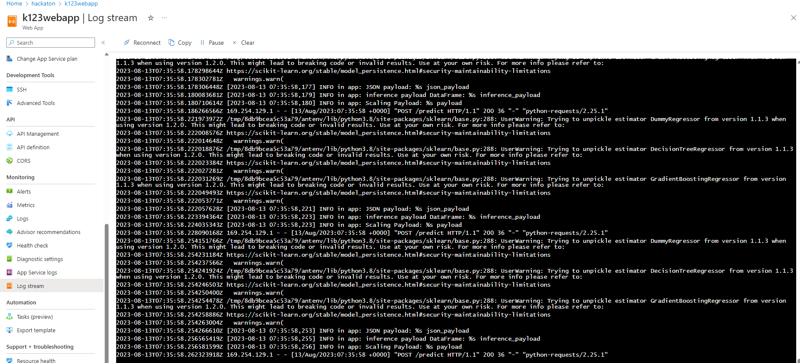

# Enhancements

- The tests performed in GitHub Actions could be brought over to Azure DevOps.
- More tests could be included to test the application.
- The application could include a UI to enable users to make predictions.
- Different performance test scenarios could be included.
- The load test could be part of the deployment pipeline.

# Demo

<TODO: Add link Screencast on YouTube>
